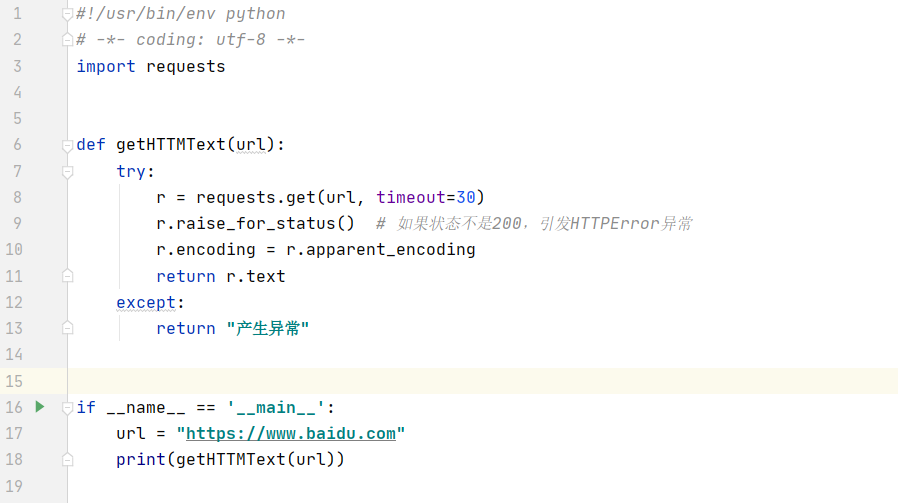

## Python爬虫

#### Requests

```python
import requests

url = 'https://www.baidu.com'
print(requests.get(url))

```

| 属性                | 说明                                             |
| :------------------ | :----------------------------------------------- |
| r.status_code       | HTTP请求的返回状态，200表示连接成功，404表示失败 |
| r.text              | HTTP响应内容的字符串形式，即，url对应的页面内容  |
| r.encoding          | 从HTTP header中猜测的相应内容编码方式            |
| r.apparent_encoding | 从内容中分析出的相应内容编码方式(备选编码方式)   |
| r.content           | HTTP相应内容的二进制形式                         |

**r.encoding：如果header中不存在charset，则认为编码为ISO-8859-1**

**r.apparent_encoding：根据网页内容分析出的编码方式**


### 通用代码框架

**理解Requests库的异常**

| 异常                      | 说明                                        |
| :------------------------ | :------------------------------------------ |
| requests.ConnectionError  | 网络连接错误异常，如DNS查询失败，拒绝连接等 |
| requests.HTTPError        | HTTP错误异常                                |
| requests.URIRequired      | URI确实异常                                 |
| requests.TooManyRedirects | 超过最大重定向次数，产生重定向异常          |
| requests.ConnectTimemout  | 连接远程服务器超时异常                      |
| requests.Timeout          | 请求URI超时，产生超时异常                   |
| r.raise_for_status()      | 如果不是200，产生异常requests.HTTPError     |



### HTTP协议与Requests库方法

**Requests库的资格主要方法**

| 方法               | 说明                                             |
| ------------------ | ------------------------------------------------ |
| requests.request() | 构造一个请求，支撑一下各方法的基础方法           |
| requests.get()     | 获取HTML网页的主要方法，对应HTTP的GET            |
| requests.head()    | 获取HTML网页头信息的方法，对应HTTP的HEAD         |
| requests.post()    | 向HTML网页提交POST请求的方法，对应于HTTP的POST   |
| requests.put()     | 向HTML网页提交PUT请求的方法，对应于HTTP的PUT     |
| requests.patch()   | 向HTML网页提交局部请求的方法，对应于HTTP的PATCH  |
| requests.delete()  | 向HTML网页提交删除请求的方法，对应于HTTP的DELETE |

**HTTP协议**

```
HTTP,Hypertext Transfer Protocol,超文本传输协议。
HTTP是一个基于"请求与响应"模式的，无状态的应用层协议。
HTTP协议采用URL作为定位网络资源的标识。

URL格式: http://host[:port][path]
host: 合法的Internet主机域名或IP地址
port: 端口号，缺省端口为80
path: 请求资源的路径

HTTP URL实例:
http://www.bit.edu.cn
http://220.181.111.188/duty

URL是通过HTTP协议存取资源的Internet路径吗，一个URL对应一个数据资源

```

**HTTP协议对资源的操作**

| 方法   | 说明                                                      |
| ------ | --------------------------------------------------------- |
| GET    | 请求获取UTL位置的资源                                     |
| HEAD   | 请求获取UTL位置资源的响应消息报告，即获得该资源的头部信息 |
| POST   | 请求向UTL位置的资源附加新的数据                           |
| PUT    | 请求向URL位置存储一个资源，覆盖原URL位置的资源            |
| PATCH  | 请求局部更新URL位置的资源，即改变该处资源的部分内容       |
| DELETE | 请求删除URL位置存储的资源                                 |

**网络服务器都是黑盒子，只能看到url数据**


**requests.request(method, url, ******kwarge)**

```
method: 请求方式，对应get/post/put等7种
url: 拟获取页面的url链接
**kwargs: 控制访问的参数，共13个
1. params: 字典或字节序列，作为参数增加到url中(拼接在url上)
2. data: 字典，字节序列或文件对象，作为Request的内容(不拼接)
3. json: JSON格式的数据，作为Request的内容
4. headers: 字典，HTTP定制头
5. cookies: 字典或CookieJar,Request中的cookie
6. auth: 元祖,支持HTTP认证功能
7. 
```

